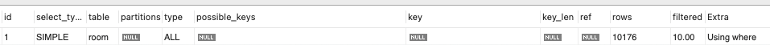
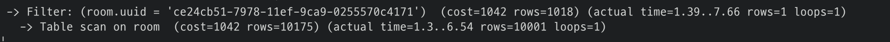
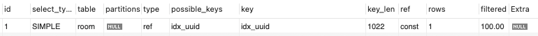
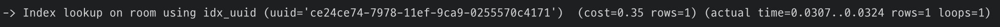
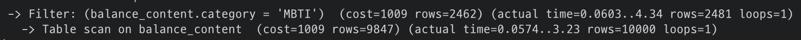

# 인덱스를 통한 성능 측정 및 개선

# 배경

서비스를 런칭해보면서 사용자를 받게 되었다. 지금 단계에서는 원활하게 서비스가 돌아가지만 만약 데이터가 계속해서 쌓이고 유저의 수가 갑작스럽게 증가한다면 우리 서비스는 대처가 되어 있을지 궁금점이 들었다. 백엔드에서 시간이 많이 걸리는 작업은 대부분 DB의 I/O 작업이고, 이 작업을 빠르게 처리한다면 사용자가 우리 서비스를 원활하게 사용할 수 있다고 생각했다. 그래서 이번기회에 사용자가 많다고 가정하고 서비스가 얼마나 원활하게 돌아가는지 측정하고 개선할 부분을 개선하고자 이 주제를 선정하게 되었다.

## 가정

앞으로 설명할 글은 다음과 같은 배경지식이 있는 독자를 가정하고 글을 작성하게 되었다.

- 기본키, 외래키와 같은 데이터베이스의 기본 개념에 대해 알고 있는 독자
- 인덱스에 대한 기본 이해가 있고 인덱스 스캔 방식에 대해 알고 있는 독자
- MySQL 쿼리문을 알고 실행 계획을 통해 성능을 확인할 수 있는 독자
- AWS EC2가 무엇이고 왜 사용하는지 알고 있는 독자

# 인덱스

간단하게 인덱스에 대해 살펴보자.

## 인덱스란?

> **인덱스**([영어](https://ko.wikipedia.org/wiki/%EC%98%81%EC%96%B4): index)는 [데이터베이스](https://ko.wikipedia.org/wiki/%EB%8D%B0%EC%9D%B4%ED%84%B0%EB%B2%A0%EC%9D%B4%EC%8A%A4) 분야에 있어서 [테이블](https://ko.wikipedia.org/wiki/%ED%85%8C%EC%9D%B4%EB%B8%94_(%EB%8D%B0%EC%9D%B4%ED%84%B0%EB%B2%A0%EC%9D%B4%EC%8A%A4))에 대한 동작의 속도를 높여주는 [자료 구조](https://ko.wikipedia.org/wiki/%EC%9E%90%EB%A3%8C_%EA%B5%AC%EC%A1%B0)를 일컫는다 (출처: 위키백과)
> 

백엔드 개발자라면 인덱스에 대해 많이들 들어보았을 것이다.

인덱스를 한글로 해석하면 ‘목차’이다. 책의 목차 처럼 특정 의 데이터를 빠르게 접근할 수 있도록 도와주는 것이 인덱스이다.

## 왜 인덱스를 적용해야할까?

> Indexes are **used to find rows with specific column values quickly**.([Mysql](https://dev.mysql.com/doc/refman/8.4/en/mysql-indexes.html))
> 

MySQL 공식 문서에서는 인덱스를 레코드를 빠르게 찾을 수 있도록 도와주는 것이라고 말하고 있다. 

만약 데이터베이스에 데이터가 많지 않다면 인덱스의 필요성을 느끼지 못할 수 있다. 하지만 만약 데이터베이스에 10만건, 100만건, 1000만건의 데이터가 있다면 원하는 단 하나의 데이터를 찾기 위해서 상당한 시간이 소모될 수 있다. 이럴 때 인덱스를 적용하게 된다면 탐색시간을 효과적으로 줄여서 원하는 데이터를 상대적으로 빠르게 조회할 수 있다.

단순히 검색 속도를 향상시키는 것 외에 인덱스를 적용하게 되면 정렬 및 그룹화를 효율적으로 수행할 수 있다는 장점이 있다. 인덱스는 B-Tree 구조로 데이터를 정렬해서 저장한다. 따라서 그룹화 및 정렬 작업을 효율적으로 수행할 수 있다.

## 인덱스를 적용하여 얻고자 하는 목표

서비스의 사용자가 급수적으로 증가해도 원활하게 돌아가는 서비스를 만드는 것이 목표이다.

# 사전 작업

## 진행 방식

원활한 성능 측정을 위해 다음과 같은 단계로 실험을 진행하려고 한다.

1. 운영 환경과 동일한 개발 환경을 구축한다.
2. 기존 애플리케이션 서버에서 사용 중인 쿼리를 분석하여 성능을 측정할 쿼리를 선정한다.
3. 동시 접속자 유저가 10만명이라고 가정한 후 성능을 측정하고 기록한다.
4. 인덱스를 적용한 뒤 성능의 변화를 측정하고 비교한다.
5. 동시 접속자 유저가 100만명이라고 가정한 후 각각 측정하고 비교한다.
6. 인덱스를 적용한 뒤 성능의 변화를 측정하고 비교한다.

동시 요청은 고려하지 않으며 한번에 한 명의 유저만 요청을 보내는 것으로 가정하고 성능을 측정하겠다.

## 운영환경과 동일한 환경

인덱스를 적용하기에 앞서, 운영 환경과 최대한 동일한 환경의 개발 환경을 만들어둔다.

**[인스턴스]**

|  | 운영 환경 | 개발 환경 |
| --- | --- | --- |
| OS Image | ubuntu-24.04-arm64 | ubuntu-24.04-arm64 |
| Instance Type | t4g.micro (2vCPU, 1GB) | t4g.micro (2vCPU, 1GB) |
| Storage | gp3(IOPS: 3000, Throughput 125), 27GiB | gp3(IOPS: 3000, Throughput 125), 27GiB |
| MySQL version | 8.0.39 | 8.0.32 |

현재 운영 환경에서 사용중인 EC2와 동일한 EC2를 개발 환경에 구성한다.

**[스왑 메모리]**

```bash
sudo dd if=/dev/zero of=/swapfile bs=128M count=16
sudo chmod 600 /swapfile
sudo mkswap /swapfile
sudo swapon /swapfile

sudo vi /etc/fstab # 아래 내용 추가
/swapfile swap swap defaults 0 0
```

원활한 데이터베이스 사용을 위해 2GB의 스왑 메모리를 두 EC2에 동일하게 설정해주었다.

**[MySQL 설치 후 동일한 스키마로 테이블 생성]**

개발 환경도 운영 환경과 같은 MySQL을 설치한 이후 동일한 스키마로 테이블을 생성해주었다.

## 성능을 개선 쿼리 선정 기준

성능 측정을 위해 우선 모든 쿼리의

성능을 측정할 쿼리를 선정하는 기준은 다음과 같다.

1. 서비스에서 자주 사용되는 쿼리
    
    서비스에서 자주 사용되는 쿼리일수록 성능 개선의 중요성이 올라간다. 따라서 필자는 서비스에서 가장 많이 사용되는 쿼리를 선정하여 집중적으로 성능을 비교해보려고 한다.
    
2. 데이터 풀 스캔, 인덱스 풀 스캔, 인덱스 머지가 발생하는 쿼리
3. 0.25초를 넘는 쿼리
    
    필자는 서비스의 사용자가 급수적으로 증가해도 원활하게 돌아가는 서비스를 만드는 것이 목표이다. 원할하게 돌아간다는 것의 의미는 모든 요청이 1초를 넘기지 않게 처리되는 것으로 기준을 잡고자 한다.
    
    이를 위해 사용자의 수가 10만명, 100만명이 되었을 때, 쿼리의 처리 속도가 0.25초를 넘기지 않도록 인덱스를 적용하고자 한다. 0.25초를 넘기는 순간 사용자는 서비스가 느리다고 판단하기 때문이다. ([참고](https://www.hankyung.com/article/2012030211791))
    

## 서비스 배경 지식

**[서비스 배경 지식]**


필자의 서비스는 ‘밸런스 게임’이다. 게임을 진행하기 위한 ‘방’이라는 객체가 있고 ‘방’에 참가자들이 모이면 게임이 라운드로 진행된다. 각 라운드에서는 밸런스 주제가 건내지고 참가자들은 주제를 보고 선택지를 고른다.

**[스키마]**


- `BALANCE_CONTENT` : 밸런스 게임 주제에 대한 테이블
- `BALANCE_OPTION` : 밸런스 게임의 선택지에 대한 테이블
- `TOTAL_BALANCE_VOTE` : 모든 사용자의 투표 결과를 저장하는 테이블
- `ROOM_CONTENT` : 방에 대한 게임의 정보를 저장하는 테이블
- `ROOM` : 방에 대한 테이블
- `MEMBER` : 참가자에 대한 테이블
- `ROOM_BALANCE_VOTE` : 방에 있는 참가자들의 투표 결과를 저장하는 테이블

기본키와 외래키만 설정되어 있으며 따로 인덱스를 설정하지 않은 상태이다.

**[상황 가정]**

2가지 상황으로 나눠서 성능을 비교하려고 한다.

1. 동시 접속자가 10만명이라고 가정하고 성능을 비교
    
    `room` 개수: 10,000 건
    
    `member` 개수: 100,000 건 (1방에 10명의 유저가 있다)
    
    `balance_content`: 10,000 건
    
    `balance_option`: 20,000 건
    
    `room_content`: 30,000건 ~ 70,000건
    
    `room_balance_vote`: 300,000건 ~ 700,000건
    
    `total_balance_vote`: 1,000,000 건
    
2. 동시 접속자가 100만명이라고 가정하고 성능을 비교
    
    `room` 개수: 100,000 건
    
    `member` 개수: 1,000,000 건 (1방에 10명의 유저가 있다)
    
    `balance_content`: 100,000 건
    
    `balance_option`: 200,000 건
    
    `room_content`: 300,000건 ~ 700,000건
    
    `room_balance_vote`: 3,000,000건 ~ 7,000,000건
    
    `total_balance_vote`: 10,000,000 건
    

# 측정

이 글에서는 분량상 3가지의 쿼리만 확인하여 비교를 수행해보겠다.

## 1.방 조회 쿼리

```sql
SELECT id, current_round, last_modified_at, category, time_limit,
				total_round, status, uuid 
FROM room
WHERE uuid = ?;
```

위 쿼리는 유저가 방에 참여할 때 해당 방을 조회하는 쿼리이다. 해당 쿼리는 기본키인 id로 조회하는 것이 아닌 uuid 칼럼으로 검색을 수행하고 있다. 따라서 인덱스 풀 스캔이 발생한다.

### 사용자가 10만인 경우

**[ 인덱스 설정 전 ]**





- Full table scan 발생
- 0.09s

**[ 인덱스 설정 후 ]**

```sql
CREATE INDEX idx_uuid ON room(uuid);
```





- 0.0083s

### 사용자가 100만인 경우

**[ 인덱스 설정 전 ]**


- Full table scan 발생
- 0.09s

**[ 인덱스 설정 후 ]**

```sql
CREATE INDEX idx_uuid ON room(uuid);
```


- 0.0099s

### 결과

**[ 10만일 때 ]**

- 0.09s → 0.0083s (약 90% 향상)

**[ 100만일 때 ]**

- 0.09s → 0.0099s (약 89% 향상)

인덱스 적용 전에는 데이터 풀 스캔이 일어나고 있었다. 따라서 레코드의 수가 급수적으로 증가하게 된다. 실행 계획의 `rows` 칼럼을 확인해보면 거의 모든 레코드를 조회한 것을 확인할 수 있다.

반면 인덱스 적용 후에는 `rows` 칼럼을 확인해보면 하나의 레코드만 탐색한 것을 확인할 수 있다. 인덱스가 적용된 room 테이블의 uuid 칼럼이 카디널리티가 높기 때문에 이러한 결과가 나온 것이다. 따라서 다음과 같이 결론을 내일 수 있다.

> **카디널리티가 높은 칼럼에 대해 조회 작업이 발생하는 경우 인덱스를 적용하면 성능이 높아질 수 있다.**
> 

## 2. 밸런스 컨텐츠 조회 쿼리

```sql
SELECT id, category, name 
FROM balance_content
WHERE category = ?;
```

위 쿼리는 게임이 시작될 때 방에 설정된 카테고리에 맞는 밸런스 컨텐츠를 가져오기 위해 수행되는 쿼리이다.

### 사용자가 10만인 경우

**[ 인덱스 설정 전 ]**




- 풀 스캔 발생
- 0.033s

**[ 인덱스 설정 후 ]**

```sql
CREATE INDEX idx_category ON balance_content(category);
```


- 인덱스 컨디션 푸시 다운 수행
- 0.019s

### 사용자가 100만인 경우

**[ 인덱스 설정 전 ]**


- 0.05s

**[ 인덱스 설정 후]**

```sql
CREATE INDEX idx_category ON balance_content(category);
```


- 0.07s

### 결과

**[ 10만 일 때 ]**

- 0.033s → 0.019s (약 42% 향상)

**[ 100만 일 때 ]**

- 0.05s → 0.07s (약 40% 하락)

사용자가 10만 일 때를 가정했을 때는 인덱스 적용시 성능이 향상되었지만, 100만 일 때를 가정했을 때는 오히려 인덱스를 적용하면 성능이 떨어졌다. 이는 category의 카디널리티가 낮기 때문이다. 실제로 해당 칼럼은 단 5개의 유니크 값을 가지고 있다. 즉, 중복된 값이 많아 카디널리티가 낮다. 이런 경우에는 인덱스를 적용하는 것이 오히려 성능 하락으로 이어질 수 있다. 따라서 다음과 같이 결론을 내릴 수 있다.

> **카디널리티가 낮은 칼럼에 대해 조회 작업이 발생하는 경우 인덱스를 적용하면 성능이 낮아질 수 있다.**
> 

## 3. 방에서 진행중인 컨텐츠 조회 쿼리

```sql
SELECT id, balance_content_id, room_id, round, vote_deadline 
FROM room_content
WHERE room_id = ? AND balance_content_id = ?;
```

위 쿼리는 투표 진행중에 호출되는 쿼리로 투표 마감 시간이 지났는지 확인할 때 발생하는 쿼리이다. 2개의 외래키를 통해 조회 작업이 일어나고 있다.

### 사용자가 10만인 경우

**[ 인덱스 설정 전 ]**


- 인덱스 머지 발생
- 0.012s

**[ 인덱스 설정 후 ]**

```sql
CREATE INDEX idx_room_balance_content ON room_content(room_id, balance_content_id);
```


- 0.011s

### 사용자가 100만인 경우

**[ 인덱스 설정 전 ]**


- 0.011s

**[ 인덱스 설정 후 ]**

```sql
CREATE INDEX idx_room_balance_content ON room_content(room_id, balance_content_id);
```


- 0.0095s

### 결과

**[ 10만일 때 결과 ]**

- 0.012s → 0.011s (약 8% 향상)

**[ 100만일 때 결과 ]**

- 0.011s → 0.0095s (약 14% 향상)

성능이 향상되었으나 그 정도가 미미하다. 

# 결론

인덱스를 잘 활용하면 조회 성능이 월등히 상승한다는 것을 확인하였다. 하지만 그와 반대로 오히려 성능 하락으로 이어지는 경우도 있고 그리고 성능이 미미하게 상승하는 경우가 있다는 것을 확인하였다. 이를 통해 **인덱스를 적용할 때는 신중히 고려해야한다**는 생각을 가지게 되었다. Real MySQL 책에 의하면 직접 레코드 1건을 조회하는 비용이 1이라면 인덱스를 통해 조회하는 작업의 비용은 4~5 정도로 예측한다. 따라서 전체 레코드의 20% ~ 25%를 넘어서면서 인덱스를 사용하는 것 보다는 모든 레코드를 읽어서 필요한 레코드만 필터링하는 방식이 더 효율적일 수 있다.

또한 인덱스를 적용하게 되면 대부분 조회 성능이 향상되지만 데이터를 추가하거나 삭제할 때 마다 B-Tree 인덱스를 탐색해야하는 과정이 발생한다. 데이터의 변경이 자주 발생하는 경우, 오히려 인덱스를 적용하는 것이 악효과로 이어질 경우가 높다. 따라서 데이터 변경이 자주 발생하는 칼럼의 경우 인덱스를 적용하는 것을 지양하는 것이 좋다. 

성능을 측정한 쿼리의 경우 모두 기준(0.25초)보다 빠른 쿼리 성능을 보여주었다. 하지만 실제 서비스로 런칭하는 경우 더 고려해야할 점이 있다. **인덱스를 적용하게 되면 레코드 단위 잠금**으로 처리할 수 있다. 만약 인덱스를 적용하지 않으면 특정 레코드를 조회하기 위해 테이블 단위에서 잠금이 발생하게 된다. 만약 동시 요청이 많이 발생하는 경우 서로 다른 레코드가 필요하여도 테이블 단위 잠금이 발생하기 때문에 요청이 지연될 수 있다. 위 성능 측정의 경우 동시 쿼리 요청을 고려하지 않고 한 명의 유저가 요청을 보냈을 때로 가정하고 진행한 것이다. 따라서 실제 서비스의 경우와 요청 속도에 차이가 있을 수 있다.

모든 것을 서비스 런칭 전에는 고려할 수 없다. 하지만 최소한 서비스에서 사용되는 쿼리를 정리해두고 유저를 받았을 때를 가정하고 성능을 측정해두는 것이 좋을 것 같다. 그래야 서비스 런칭 이후 특정 쿼리 성능이 떨어지는 경우 빠르게 대응이 가능할 것 같다.